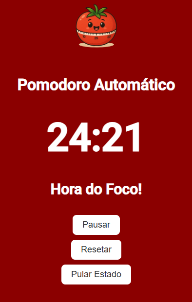

# ⏱️ Pomodoro Automático

Um temporizador Pomodoro feito em **HTML, CSS e JavaScript**, com ciclos automáticos de foco e descanso.



## ℹ️ O que é a técnica Pomodoro?
É uma técnica de produtividade que divide o trabalho em ciclos:
- 25 minutos de foco
- 5 minutos de descanso curto
- 15 minutos de descanso longo a cada 4 ciclos

## 🚀 Funcionalidades
- ⏰ Ciclo automático de 25 minutos de foco
- 🟢 Descanso curto de 5 minutos
- 🔵 Descanso longo de 15 minutos a cada 4 ciclos
- 🎨 Fundo muda de cor conforme o estado
- ⏯️ Botões de Pausar/Continuar, Resetar e Pular Estado
- 🍅 Ícone do tomate como logo

## 🔮 Melhorias Futuras
- Sons de alarme no final de cada ciclo
- Customização do tempo pelo usuário

## 🛠️ Tecnologias
- HTML5 
- CSS3 (Flexbox, Transições) 
- JavaScript (DOM, setInterval, EventListeners) 

## ▶️ Como usar
1. Clone este repositório:
   ```bash
   git clone https://github.com/othipedroso/pomodoro.git
   ```
2. Abra o arquivo `index.html` no navegador.

## 🌐 Deploy
Acesse o projeto online: [Pomodoro Automático](https://othipedroso.github.io/pomodoro/)

## 📄 Licença
Este projeto está sob a licença MIT - sinta-se livre para usar e modificar.
